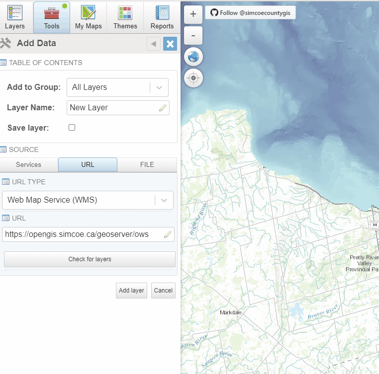
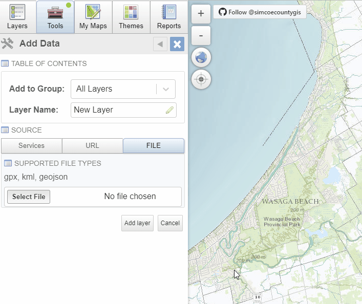

#### [Home](../../)

# Add Data Tool
The Add Data Tool allows you to import data into the Layers/Table of Contents panel. The three sources of data that can be added are file, URL, and services. 

## To add data:
1. Select Tools and then select Add Data
2. Select the group you want to add your data too from the drop down menu
3. Enter the Layer Name 
3. Once data is loaded in select Add Layer to save and load the data into the map 
 

## To add File data:
1. Under Source select File
2. Select Select File, this will open your computer's files
3. Select a file that is one of the following supported formats: **KML, gpx, or geojson**
4. Select Add Layer to add the data to the map
 

## To add URL data:
1. Under Source select URL 
2. Select a URL Type from the drop down menu that is supplied
    - Web Map Service (WMS)
    - Web Map Tile Service (WMTS)
    - Web Feature Service
    - Tile with XYZ format
3. Enter a valid url (eg: geoserver - https://opengis.simcoe.ca/geoserver/ows, ArcGIS - https://maps.simcoe.ca/arcgis/services/Public/Operational_Layers_Dynamic/MapServer/WMSServer)
4. Check for layers, if layers are found, select a layer 
5. Select Add Layer to add the data to the map
 

## To add Services data: 
1. Under Source select Services
2. From the Provincial Open Data select an available layer from the drop down menu 
3. Select Add Layer to add data to the map

**Provincial Open Data**
Lists all layers found in Open LIO Data - https://ws.lioservices.lrc.gov.on.ca/arcgis1071a/rest/services/LIO_OPEN_DATA

 

#### [Top](#home)